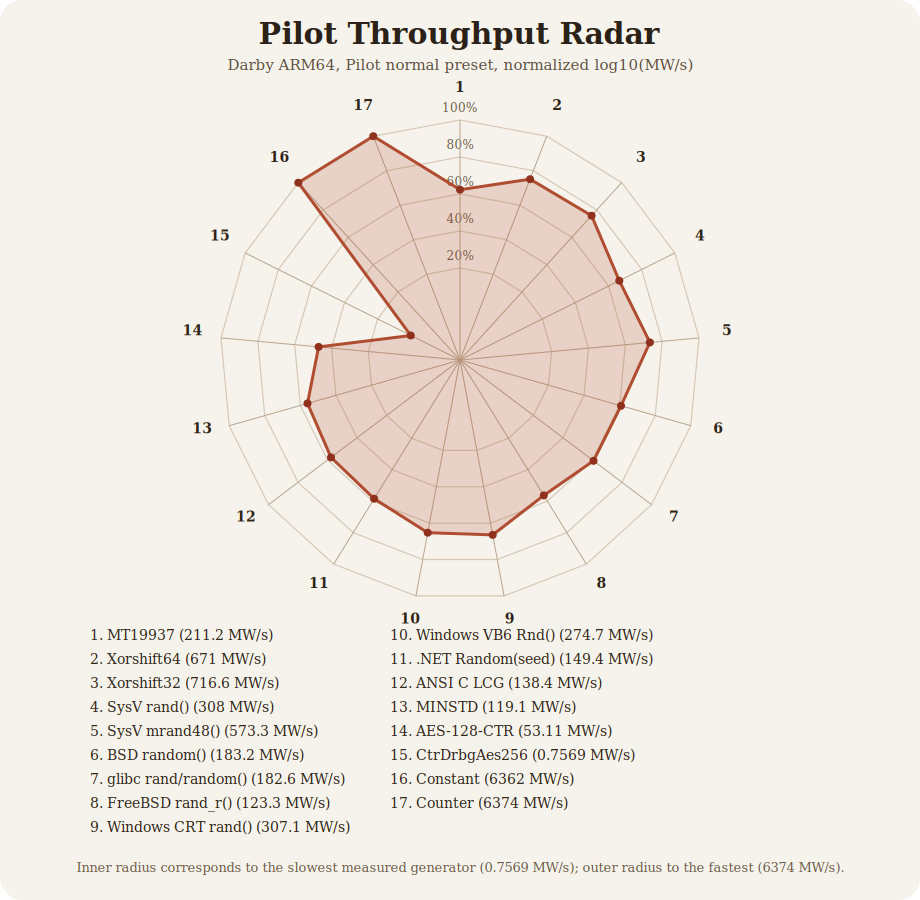

# Benchmarks

Pilot throughput run for the current `entropy` worktree on `darby.local` (`Linux aarch64`), using `pilot-bench` `run_program --preset normal`.

This pass intentionally excludes `OsRng`, `BBS`, and `Blum-Micali`, per the pilot brief. It does include the crufty historical Unix and Windows generators, including:

- System V `rand()` and `mrand48()`
- BSD `random()`
- Linux glibc `rand()/random()`
- FreeBSD `rand_r()` compatibility
- Windows CRT `rand()`
- VB6/VBA `Rnd()`
- classic `.NET Random(seed)` compatibility

## Results

Throughput is reported in millions of 32-bit words per second (`MW/s`). `Runs` is the number of Pilot samples used to hit the normal-preset confidence target.

| Generator | MW/s | 95% CI | Runs |
|---|---:|---:|---:|
| `MT19937 (seed=19650218)` | 211.2 | ±3.965 | 50 |
| `Xorshift64 (seed=1)` | 671.0 | ±7.236 | 51 |
| `Xorshift32 (seed=1)` | 716.6 | ±8.323 | 50 |
| `BAD Unix System V rand() (seed=1)` | 308.0 | ±0.1436 | 80 |
| `BAD Unix System V mrand48() (seed=1)` | 573.3 | ±1.411 | 50 |
| `BAD Unix BSD random() TYPE_3 (seed=1)` | 183.2 | ±0.07262 | 170 |
| `BAD Unix Linux glibc rand()/random() (seed=1)` | 182.6 | ±0.5047 | 80 |
| `BAD Unix FreeBSD12 rand_r() compat (seed=1)` | 123.3 | ±0.1136 | 80 |
| `BAD Windows CRT rand() (seed=1)` | 307.1 | ±1.075 | 83 |
| `BAD Windows VB6/VBA Rnd() (seed=1)` | 274.7 | ±0.9394 | 51 |
| `BAD Windows .NET Random(seed=1) compat` | 149.4 | ±0.6626 | 82 |
| `ANSI C sample LCG (seed=1)` | 138.4 | ±0.04755 | 50 |
| `LCG MINSTD (seed=1)` | 119.1 | ±2.011 | 50 |
| `AES-128-CTR (NIST key)` | 53.11 | ±0.6654 | 50 |
| `cryptography::CtrDrbgAes256 (seed=00..2f)` | 0.7569 | ±0.003094 | 50 |
| `Constant (0xDEAD_DEAD)` | 6362 | ±90.82 | 50 |
| `Counter (0,1,2,...)` | 6374 | ±57.66 | 50 |

The synthetic ceiling generators dominate raw throughput, so the visual uses normalized `log10(MW/s)` rather than a linear scale.

