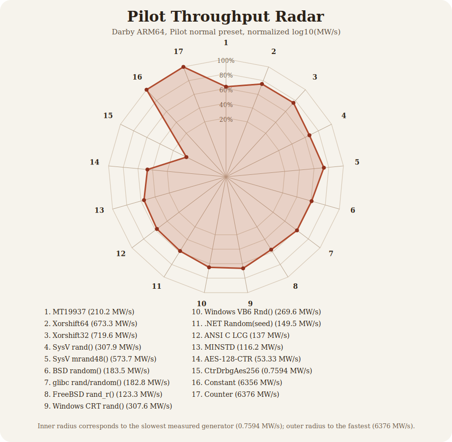

# Benchmarks

Pilot throughput run for the current `entropy` worktree on `darby.local` (`Linux aarch64`), using `pilot-bench` `run_program --preset normal`.

This pass intentionally excludes `OsRng`, `BBS`, and `Blum-Micali`, per the pilot brief. It does include the historical Unix and Windows generators, including:

- System V `rand()` and `mrand48()`
- BSD `random()`
- Linux glibc `rand()/random()`
- FreeBSD `rand_r()` compatibility
- Windows CRT `rand()`
- VB6/VBA `Rnd()`
- classic `.NET Random(seed)` compatibility

Source log: `darby-pilot.log` (kept locally)

## Results

Throughput is reported in millions of 32-bit words per second (`MW/s`). `Runs` is the number of Pilot samples used to hit the normal-preset confidence target.

| Generator | MW/s | 95% CI | Runs |
|---|---:|---:|---:|
| `MT19937 (seed=19650218)` | 208.8 | ±6.117 | 50 |
| `Xorshift64 (seed=1)` | 643.9 | ±31.97 | 320 |
| `Xorshift32 (seed=1)` | 678.4 | ±36.32 | 201 |
| `BAD Unix System V rand() (seed=1)` | 277.2 | ±17.89 | 111 |
| `BAD Unix System V mrand48() (seed=1)` | 522.9 | ±36.15 | 54 |
| `BAD Unix BSD random() TYPE_3 (seed=1)` | 171.9 | ±8.179 | 58 |
| `BAD Unix Linux glibc rand()/random() (seed=1)` | 172.0 | ±8.611 | 88 |
| `BAD Unix FreeBSD12 rand_r() compat (seed=1)` | 115.1 | ±6.15 | 110 |
| `BAD Windows CRT rand() (seed=1)` | 285.7 | ±16.64 | 290 |
| `BAD Windows VB6/VBA Rnd() (seed=1)` | 251.9 | ±14.94 | 50 |
| `BAD Windows .NET Random(seed=1) compat` | 136.1 | ±8.692 | 50 |
| `ANSI C sample LCG (seed=1)` | 125.6 | ±6.222 | 57 |
| `LCG MINSTD (seed=1)` | 110.9 | ±4.837 | 57 |
| `AES-128-CTR (NIST key)` | 52.16 | ±1.268 | 384 |
| `cryptography::CtrDrbgAes256 (seed=00..2f)` | 0.7516 | ±0.007658 | 50 |
| `Constant (0xDEAD_DEAD)` | 6310 | ±161.8 | 50 |
| `Counter (0,1,2,...)` | 6297 | ±151.2 | 50 |

The synthetic ceiling generators dominate raw throughput, so the visual uses normalized `log10(MW/s)` rather than a linear scale.

## Generator Notes

These throughput numbers say how fast each generator emits 32-bit words on
Darby. They do **not** certify quality or safety. For that, see the current
full-battery results in [TESTS.md](TESTS.md).

### `MT19937 (seed=19650218)`

MT19937 is the 32-bit Mersenne Twister with period $2^{19937}-1$, using the
standard twisted recurrence on a 624-word state plus tempering on output. It is
an excellent historical simulation PRNG and a useful statistical baseline, but
it is not a cryptographic generator: its state can be reconstructed from enough
output, and once the state is known the stream is completely predictable. The
speed here is respectable, and the battery results in [TESTS.md](TESTS.md)
still look broadly healthy, but that should be read as "good for classic
simulation use," not "safe for secrets."

### `Xorshift64 (seed=1)`

This is Marsaglia's 64-bit xorshift core
$x \leftarrow x \oplus (x \ll 13)$,
$x \leftarrow x \oplus (x \gg 7)$,
$x \leftarrow x \oplus (x \ll 17)$,
with the harness emitting the high 32 bits of each updated state. It is very
fast because it is just a few shifts and xors, and it often looks cleaner than
it deserves in medium-sized batteries. That does **not** make it safe: it is a
small-state linear generator over $\mathbb{F}_2$, hence predictable and
unsuitable for cryptography. The current tests do catch some structure; see
[TESTS.md](TESTS.md), but the right interpretation is still "fast historical
toy / simulation-grade only."

### `Xorshift32 (seed=1)`

This is the classic 32-bit xorshift
$x \leftarrow x \oplus (x \ll 13)$,
$x \leftarrow x \oplus (x \gg 17)$,
$x \leftarrow x \oplus (x \ll 5)$.
It is even smaller-state and more fragile than the 64-bit version, which is
why it is both extremely fast and much easier to embarrass statistically. It
is not appropriate for any security use, and the full battery in
[TESTS.md](TESTS.md) already treats it much more harshly than the stronger
generators.

### `BAD Unix System V rand() (seed=1)`

This is the classic 15-bit libc LCG
$x_{n+1} = 1103515245\,x_n + 12345 \pmod{2^{32}}$,
with output
$y_n = (x_n \gg 16)\ \&\ 0x7fff$.
It is historically important precisely because it is bad: tiny effective
output width, linear structure, and easy predictability. It remains useful here
as a negative control and compatibility target. The benchmark shows it is fast;
[TESTS.md](TESTS.md) shows why that speed is worthless for serious use.

### `BAD Unix System V mrand48() (seed=1)`

`mrand48()` is the POSIX 48-bit LCG
$x_{n+1} = (0x5DEECE66D\,x_n + 0xB) \bmod 2^{48}$,
with the high bits returned as output. It is materially better than old
15-bit `rand()`, which is why it survives more tests and runs faster than
heavier modern CSPRNGs, but it is still just a linear congruential generator.
That means it is predictable, non-cryptographic, and inappropriate for key
material, nonces, or anything adversarial. The full battery in
[TESTS.md](TESTS.md) is the right place to see where it still bends.

### `BAD Unix BSD random() TYPE_3 (seed=1)`

BSD `random()` is the additive lagged generator with TYPE_3 state, roughly
$x_n = x_{n-3} + x_{n-31} \pmod{2^{32}}$,
followed by a right shift on output. Historically it was a real improvement
over tiny libc LCGs, and that shows up in the test counts: it often looks much
cleaner than the old 15-bit families. But it is still a weak user-space PRNG,
not a cryptographic one, and its state is recoverable. Treat the decent
throughput and relatively mild fail count as "less embarrassing bad Unix RNG,"
not as a recommendation.

### `BAD Unix Linux glibc rand()/random() (seed=1)`

On glibc, `rand()` is effectively `random()`, so this benchmark entry is the
same Berkeley-derived additive generator as BSD `random()`. Its behavior is
therefore close to the BSD line in both speed and statistical profile. It is
still a historical libc generator, still predictable, and still not safe for
security. Readers should not let the modest fail count in [TESTS.md](TESTS.md)
trick them into thinking it belongs anywhere near cryptographic use.

### `BAD Unix FreeBSD12 rand_r() compat (seed=1)`

This compatibility path is the single-word Park-Miller family:
$x_{n+1} = 16807\,x_n \pmod{2^{31}-1}$,
with a small ABI-shaped wrapper around the returned value. It exists here
because real systems shipped it, not because it is good. Like other one-word
LCGs, it is predictable and structurally weak. The benchmark page shows it is
slower than some other historical junk; [TESTS.md](TESTS.md) shows it also
fails more often than the BSD/glibc additive family.

### `BAD Windows CRT rand() (seed=1)`

This is the old MSVCRT/UCRT generator
$x_{n+1} = 214013\,x_n + 2531011 \pmod{2^{32}}$,
with output
$y_n = (x_n \gg 16)\ \&\ 0x7fff$.
It is one of the notorious bad Windows RNGs: tiny 15-bit outputs, obvious
linearity, and trivial predictability. It is in the benchmark because it was
widely deployed in real code, not because it deserves respect. See
[TESTS.md](TESTS.md) for how the battery treats it.

### `BAD Windows VB6/VBA Rnd() (seed=1)`

VB6/VBA `Rnd()` uses a 24-bit linear state with update
$x_{n+1} = (0x43FD43FD\,x_n + 0x00C39EC3) \bmod 2^{24}$,
then scales that tiny state into a floating-point sample in $[0,1)$. This is
catastrophically small and easy to predict, which is exactly why it is one of
the most heavily destroyed entries in [TESTS.md](TESTS.md). It is a wonderful
museum piece and a terrible random number generator.

### `BAD Windows .NET Random(seed=1) compat`

Classic `.NET` `System.Random(seed)` is a subtractive generator with a
55-element table, descended from Knuth-style lagged subtraction methods rather
than a one-word LCG. That gives it more apparent statistical grace than the
CRT and VB6 generators, but it is still not a CSPRNG and was never meant to
protect secrets. The benchmark shows middling speed; the test report shows that
it can still look deceptively clean in one run. The right conclusion is
"legacy application PRNG," not "safe modern randomness."

### `ANSI C sample LCG (seed=1)`

This is the textbook sample LCG
$x_{n+1} = 1103515245\,x_n + 12345 \pmod{2^{31}}$.
It is not meant to represent some hidden good libc implementation; it is here
as the famous printed-manual recurrence that showed up in endless example code.
It is fast because it is trivial arithmetic, and it is awful because that same
arithmetic creates glaring lattice and serial structure. The battery results in
[TESTS.md](TESTS.md) are exactly the reason this entry exists.

### `LCG MINSTD (seed=1)`

MINSTD is the Park-Miller multiplicative congruential generator
$x_{n+1} = 16807\,x_n \pmod{2^{31}-1}$.
Historically it was a serious improvement over many older LCGs, and it is a
nice clean mathematical benchmark, but it is still a small-state linear
generator and still not remotely cryptographic. The throughput is unremarkable
and the full battery in [TESTS.md](TESTS.md) is very hard on it, which is the
correct modern attitude.

### `AES-128-CTR (NIST key)`

This generator emits
$Y_i = \operatorname{AES}_K(\mathrm{ctr}+i)$
in counter mode under a fixed 128-bit AES key, then slices each 128-bit block
into four 32-bit words. As a construction, AES-CTR is cryptographically strong
when the key is secret and the counter/nonce discipline is correct. In this
repository it is used as a deterministic benchmark fixture, so the key is fixed
for reproducibility, not secrecy. Its slower throughput is the cost of doing
real block-cipher work; its test behavior in [TESTS.md](TESTS.md) is the right
place to judge whether this fixture looks statistically healthy.

### `cryptography::CtrDrbgAes256 (seed=00..2f)`

This is the sibling `cryptography` crate's `CtrDrbgAes256`, i.e. an
AES-256-based CTR_DRBG in the NIST SP 800-90A style, seeded here with a fixed
48-byte test vector for repeatability. Unlike the historical libc generators,
this is meant to represent a real cryptographic design. It is by far the
slowest entry in the table because it is doing full DRBG machinery rather than
just a toy recurrence, but that is the price of a serious generator. The
full-battery behavior in [TESTS.md](TESTS.md) is the relevant safety evidence.

### `Constant (0xDEAD_DEAD)`

This is not a generator in any meaningful sense: it returns the same 32-bit
word forever,
$x_n = c$ for all $n$.
It appears in the benchmark as a synthetic ceiling and as a sanity check that
the test suite really does annihilate obvious garbage. Its enormous throughput
is meaningless except as a reminder that speed alone says nothing about
randomness.

### `Counter (0,1,2,...)`

This fixture returns the deterministic arithmetic progression
$x_n = x_0 + n \pmod{2^{32}}$.
Like the constant stream, it is present to make sure the statistical battery
and the benchmark report keep a clear distinction between "fast" and "good."
It is almost as fast as the constant generator and almost maximally unsuitable
for any use that actually requires randomness; [TESTS.md](TESTS.md) shows that
plainly.
